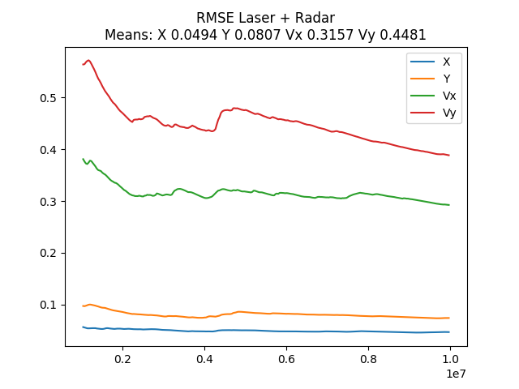

# SFND_Unscented_Kalman_Filter
## George V. Paul
[Github link to this project is here](https://github.com/gvp-study/SFND_Unscented_Kalman_Filter.git)


In this project you will implement an Unscented Kalman Filter to estimate the state of multiple cars on a highway using noisy lidar and radar measurements. Passing the project requires obtaining RMSE values that are lower that the tolerance outlined in the project rubric.


`main.cpp` is using `highway.h` to create a straight 3 lane highway environment with 3 traffic cars and the main ego car at the center.
The viewer scene is centered around the ego car and the coordinate system is relative to the ego car as well. The ego car is green while the
other traffic cars are blue. The traffic cars will be accelerating and altering their steering to change lanes. Each of the traffic car's has
it's own UKF object generated for it, and will update each indidual one during every time step.

The red spheres above cars represent the (x,y) lidar detection and the purple lines show the radar measurements with the velocity magnitude along the detected angle. The Z axis is not taken into account for tracking, so you are only tracking along the X/Y axis.

---
## UKF Noise Standard Deviations
I modified the linear acceleration noise and the yaw rotation acceleration noise. The standard deviations were changed to the values shown below. These values were considerably lower than the given values of 30.
```C++
UKF::UKF() {
...
  // Process noise standard deviation longitudinal acceleration in m/s^2
  std_a_ = 5.0;

  // Process noise standard deviation yaw acceleration in rad/s^2
  std_yawdd_ = 3.0;
```
To implement the UKF, I added the following member variables like number of augmented state elements, lambda, weights, and initialized the starting state x_ and the plant covariance P_ as shown below.

```C++

  // Standard state dimension
  n_x_ = 5;

  // Augmented state dimension
  n_aug_ = 7;

  // Lambda
  lambda_ = 3 - n_aug_;

  // Weight vector  2n+1 weights_
  weights_ = VectorXd(2*n_aug_+1);
  weights_(0) = lambda_/(lambda_+(double)n_aug_);
  for (int i=1; i<2*n_aug_+1; i++)
  {
    double weight = 0.5/((double)(n_aug_)+lambda_);
    weights_(i) = weight;
  }

  // Init State.
  x_.setZero();

  // Init Plant Covariance
  P_ = MatrixXd::Identity(n_x_, n_x_);
  P_(2, 2) = P_(3, 3) = P_(4, 4) = 0.5;

  // Sigma point matrix
  Xsig_pred_ = MatrixXd(n_x_, 2*n_x_ + 1);
  Xsig_pred_.setZero();

```
### ProcessMeasurements
I then filled in the ProcessMeasurements() functions as follows.
```C++
void UKF::ProcessMeasurement(MeasurementPackage meas_package) {
    bool is_radar = meas_package.sensor_type_ == MeasurementPackage::RADAR;
    bool is_lidar = meas_package.sensor_type_ == MeasurementPackage::LASER;
    /**
     * TODO: Complete this function! Make sure you switch between lidar and radar
     * measurements.
     */
    time_us_ = meas_package.timestamp_;
    // Find the delta t
    double dt = (time_us_ - previous_time_us_) / 1000000.0;	//dt - expressed in seconds
    previous_time_us_ = time_us_;
    /*
     * Initialize the filter.
     */
    if(!is_initialized_)
    {
	// Try to initialize from the first measurement
	if (is_radar)
	{
	    //
	    //Convert radar from polar to cartesian coordinates and initialize state.
	    //
	    double r = meas_package.raw_measurements_[0];
	    double phi = meas_package.raw_measurements_[1];
	    double rdot = meas_package.raw_measurements_[2];
	    x_(0) = r * cos(phi);
	    x_(1) = r * sin(phi);
	    x_(2) = rdot;
	    x_(3) = 0.0;
	    x_(4) = 0.0;

	}
	else if (meas_package.sensor_type_ == MeasurementPackage::LASER) {
	    //
	    //Initialize state.
	    //
	    x_(0) = meas_package.raw_measurements_[0];
	    x_(1) = meas_package.raw_measurements_[1];
	    x_(2) = 0.0;
	    x_(3) = 0.0;
	    x_(4) = 0.0;
	}

	dt = 0.0;
	is_initialized_ = true;
	return;
    }
    //
    // Predict using the delta t
    //
    while (dt > 0.1) {
        constexpr double delta_t = 0.05;
        Prediction(delta_t);
        dt -= delta_t;
    }
    Prediction(dt);
//    Prediction(dt);
    //
    // Update using measurements.
    //
    if (is_radar && use_radar_) {
	// Radar updates
	UpdateRadar(meas_package);
    } else if(is_lidar && use_laser_) {
	// Laser updates
	UpdateLidar(meas_package);
    }

    // print the output
    cout << "Now " << time_us_ << " Old " << previous_time_us_ << " DT " << dt << endl;
    cout << "x_ " << x_.transpose() << endl;
//  cout << "P_\n" << P_ << endl;

}
```
### Prediction
I then filled in the Prediction() function.
```C++
void UKF::Prediction(double delta_t) {
  /**
   * TODO: Complete this function! Estimate the object's location.
   * Modify the state vector, x_. Predict sigma points, the state,
   * and the state covariance matrix.
   */
   //set state dimension
  int n_x = n_x_;

  //set augmented dimension
  int n_aug = n_aug_;

  //Process noise standard deviation longitudinal acceleration in m/s^2
  double std_a = std_a_;

  //Process noise standard deviation yaw acceleration in rad/s^2
  double std_yawdd = std_yawdd_;

  //define spreading parameter
  double lambda = 3 - n_aug;

  //set example state
  VectorXd x = x_;

  //create example covariance matrix
  MatrixXd P = P_;

  //create augmented mean vector
  VectorXd x_aug = VectorXd(n_aug);

  //create augmented state covariance
  MatrixXd P_aug = MatrixXd(n_aug, n_aug);
  P_aug.setZero();

  //create sigma point matrix
  MatrixXd Xsig_aug = MatrixXd(n_aug, 2 * n_aug + 1);
  Xsig_aug.setZero();

/*******************************************************************************
 * Augmented Sigma Points
 ******************************************************************************/

  //create augmented mean state
  x_aug.head(n_x) = x;
  x_aug(5) = 0.0;
  x_aug(6) = 0.0;
  //create augmented covariance matrix
  P_aug.topLeftCorner(n_x, n_x) = P;
  MatrixXd Q(2, 2);
  Q << std_a * std_a, 0.0,
  0.0, std_yawdd * std_yawdd;
  P_aug.bottomRightCorner(2, 2) = Q;
  //create square root matrix
  MatrixXd S = P_aug.llt().matrixL();
  //create augmented sigma points
  Xsig_aug.col(0) = x_aug;
  double factor = sqrt(n_aug+lambda);
  for(int i = 0; i < n_aug; i++)
  {
    Xsig_aug.col(i+1)       = x_aug + factor * S.col(i);
    Xsig_aug.col(i+1+n_aug) = x_aug - factor * S.col(i);
  }
  //print result
  std::cout << "Xsig_aug = " << std::endl << Xsig_aug.transpose() << std::endl;
//  std::cout << "P_aug = " << std::endl << P_aug << std::endl;
  std::cout << "x_aug = " << std::endl << x_aug.transpose() << std::endl;
  //create matrix with predicted sigma points as columns
  MatrixXd Xsig_pred = MatrixXd(n_x, 2 * n_aug + 1);

  /*******************************************************************************
   * Sigma Point Prediction.
   ******************************************************************************/

  //predict sigma points
  int n = 2*n_aug + 1;
  for(int i = 0; i < n; i++)
  {
    double px = Xsig_aug(0, i);
    double py = Xsig_aug(1, i);
    double v = Xsig_aug(2, i);
    double yaw = Xsig_aug(3, i);
    double yawd = Xsig_aug(4, i);
    double nu_a = Xsig_aug(5, i);
    double nu_yawdd = Xsig_aug(6, i);
    // predicted state
    double px_p, py_p;

    //avoid division by zero
    if(fabs(yawd) > 0.001)
    {
        px_p = px + v/yawd * ( sin(yaw + yawd*delta_t) - sin(yaw));
        py_p = py + v/yawd * (-cos(yaw + yawd*delta_t) + cos(yaw));
    }
    else
    {
        px_p = px + v * delta_t * cos(yaw);
        py_p = py + v * delta_t * sin(yaw);
    }
    double v_p = v;
    double yaw_p = yaw + yawd*delta_t;
    double yawd_p = yawd;

    // add noise
    px_p = px_p + 0.5*nu_a*delta_t*delta_t * cos(yaw);
    py_p = py_p + 0.5*nu_a*delta_t*delta_t * sin(yaw);
    v_p = v_p + nu_a*delta_t;

    yaw_p = yaw_p + 0.5*nu_yawdd*delta_t*delta_t;
    yawd_p = yawd_p + nu_yawdd*delta_t;
    //write predicted sigma points into right column
    Xsig_pred(0, i) = px_p;
    Xsig_pred(1, i) = py_p;
    Xsig_pred(2, i) = v_p;
    Xsig_pred(3, i) = yaw_p;
    Xsig_pred(4, i) = yawd_p;
  }

  /*******************************************************************************
   * Predict Mean and Covariance from the Sigma Points
   ******************************************************************************/
  VectorXd weights = weights_;

  //predicted state mean
  x.fill(0.0);
  for (int i = 0; i < 2 * n_aug + 1; i++) {  //iterate over sigma points
    x = x + weights(i) * Xsig_pred.col(i);
  }

  //predicted state covariance matrix
  P.fill(0.0);
  for (int i = 0; i < 2 * n_aug + 1; i++) {  //iterate over sigma points

    // state difference
    VectorXd x_diff = Xsig_pred.col(i) - x;
    //angle normalization
    while (x_diff(3)> M_PI) x_diff(3)-=2.*M_PI;
    while (x_diff(3)<-M_PI) x_diff(3)+=2.*M_PI;

    P = P + weights(i) * x_diff * x_diff.transpose() ;
  }

  //print result
  std::cout << "Predicted state " << delta_t << std::endl;
  std::cout << x.transpose() << std::endl;
//  std::cout << "Predicted covariance matrix" << std::endl;
//  std::cout << P << std::endl;

  //write result
  x_= x;
  P_ = P;
  Xsig_pred_ = Xsig_pred;

}
```
### UpdateLidar
I then filled in the UpdateLidar() function like so:
```C++
void UKF::UpdateLidar(MeasurementPackage meas_package) {
  /**
   * TODO: Complete this function! Use lidar data to update the belief
   * about the object's position. Modify the state vector, x_, and
   * covariance, P_.
   * You can also calculate the lidar NIS, if desired.
   */
  cout << "LIDAR" << endl;

  //set state dimension
  int n_x = n_x_;

  //set augmented dimension
  int n_aug = n_aug_;

  //set measurement dimension, radar can measure r, phi, and r_dot
  int n_z = 2;

  double lx = meas_package.raw_measurements_[0];
  double ly = meas_package.raw_measurements_[1];
  VectorXd z(n_z);
  z << lx, ly;

  //define spreading parameter
  VectorXd weights = weights_;

  //laser measurement noise standard deviation in m in X.
  double std_laspx = std_laspx_;

  //laser measurement noise standard deviation in m in Y.
  double std_laspy = std_laspy_;

  //create example matrix with predicted sigma points
  MatrixXd Xsig_pred = Xsig_pred_;

  //create matrix for sigma points in measurement space
  MatrixXd Zsig = MatrixXd(n_z, 2 * n_aug + 1);
  Zsig.setZero();

/*******************************************************************************
 * Predict Lidar Measurements from Sigma Points
 ******************************************************************************/

  //transform sigma points into measurement space
  for (int i = 0; i < 2 * n_aug + 1; i++) {  //2n+1 simga points

    // extract values for better readability
    double p_x = Xsig_pred(0,i);
    double p_y = Xsig_pred(1,i);

    // measurement model
    Zsig(0,i) = p_x;
    Zsig(1,i) = p_y;
  }

//  std::cout << "Zsig Laser: " << std::endl << Zsig.transpose() << std::endl;

  //mean predicted measurement
  VectorXd z_pred = VectorXd(n_z);
  z_pred.fill(0.0);
  for (int i=0; i < 2*n_aug+1; i++) {
    z_pred = z_pred + weights(i) * Zsig.col(i);
  }
  //innovation covariance matrix S
  MatrixXd S = MatrixXd(n_z,n_z);
  S.fill(0.0);
  for (int i = 0; i < 2 * n_aug + 1; i++) {  //2n+1 simga points
    //residual
    VectorXd z_diff = Zsig.col(i) - z_pred;

    //angle normalization
    while (z_diff(1)> M_PI) z_diff(1)-=2.*M_PI;
    while (z_diff(1)<-M_PI) z_diff(1)+=2.*M_PI;

    S = S + weights(i) * z_diff * z_diff.transpose();
  }

  //add measurement noise covariance matrix
  MatrixXd R = MatrixXd(n_z,n_z);
  R <<    std_laspx*std_laspx, 0,
  0, std_laspy*std_laspy;

  S = S + R;

  //print result
//  std::cout << "z_pred Laser: " << std::endl << z_pred.transpose() << std::endl;
//  std::cout << "S Laser: " << std::endl << S << std::endl;

  //create example vector for predicted state mean
  VectorXd x = x_;

  //create example matrix for predicted state covariance
  MatrixXd P = P_;

  //create matrix for cross correlation Tc
  MatrixXd Tc = MatrixXd(n_x, n_z);

/*******************************************************************************
 * Update State from the Measurement
 ******************************************************************************/

  //calculate cross correlation matrix
  Tc.fill(0.0);
  for (int i = 0; i < 2 * n_aug + 1; i++) {  //2n+1 simga points

    //residual
    VectorXd z_diff = Zsig.col(i) - z_pred;

    // state difference
    VectorXd x_diff = Xsig_pred.col(i) - x;
    //angle normalization
    while (x_diff(3)> M_PI) x_diff(3)-=2.*M_PI;
    while (x_diff(3)<-M_PI) x_diff(3)+=2.*M_PI;

    Tc = Tc + weights(i) * x_diff * z_diff.transpose();
  }

  //Kalman gain K;
  MatrixXd Sinv = S.inverse();
  MatrixXd K = Tc * Sinv;

  //residual
  VectorXd z_diff = z - z_pred;

  //update state mean and covariance matrix
  x = x + K * z_diff;
//  std::cout << "Innovation Lidar state dx: " << std::endl << K*z_diff << std::endl;

  while (x(3)> M_PI) x(3)-=2.*M_PI;
  while (x(3)<-M_PI) x(3)+=2.*M_PI;

  P = P - K*S*K.transpose();
  //
  // Compute the Normalized Innovation Squared value (NIS).
  //
  double e = z_diff.transpose() * Sinv * z_diff;
  lidar_nis_.push_back(e);

  //print result
  std::cout << "Updated state x: " << std::endl << x.transpose() << std::endl;
//  std::cout << "Updated state covariance P: " << std::endl << P << std::endl;
  std::cout << "Lidar NIS : "  << e << std::endl;
  //write result
  x_ = x;
  P_ = P;

}
```
### UpdateRadar

The Predicition() function used the UpdateRadar() function.
```C++
void UKF::UpdateRadar(MeasurementPackage meas_package) {
  /**
   * TODO: Complete this function! Use radar data to update the belief
   * about the object's position. Modify the state vector, x_, and
   * covariance, P_.
   * You can also calculate the radar NIS, if desired.
   */
  cout << "RADAR" << endl;
  /**
     Convert radar from polar to cartesian coordinates and initialize state.
  */

  //set state dimension
  int n_x = n_x_;

  //set augmented dimension
  int n_aug = n_aug_;

  //set measurement dimension, radar can measure r, phi, and r_dot
  int n_z = 3;

  //define spreading parameter
  VectorXd weights = weights_;

  //radar measurement noise standard deviation radius in m
  double std_radr = std_radr_;

  //radar measurement noise standard deviation angle in rad
  double std_radphi = std_radphi_;

  //radar measurement noise standard deviation radius change in m/s
  double std_radrd = std_radrd_;

  //create example matrix with predicted sigma points
  MatrixXd Xsig_pred = Xsig_pred_;

  //create matrix for sigma points in measurement space
  MatrixXd Zsig = MatrixXd(n_z, 2 * n_aug + 1);
  Zsig.setZero();

/*******************************************************************************
 * Predict Radar Measurements from Sigma Points
 ******************************************************************************/

  //transform sigma points into measurement space
  for (int i = 0; i < 2 * n_aug + 1; i++) {  //2n+1 simga points

    // extract values for better readibility
    double p_x = Xsig_pred(0,i);
    double p_y = Xsig_pred(1,i);
    double v  = Xsig_pred(2,i);
    double yaw = Xsig_pred(3,i);

    double v1 = cos(yaw)*v;
    double v2 = sin(yaw)*v;

    // measurement model
    if(hypot(p_x, p_y) > 0.001)
    {
      Zsig(0,i) = sqrt(p_x*p_x + p_y*p_y);                        //r
      Zsig(1,i) = atan2(p_y,p_x);                                 //phi
      Zsig(2,i) = (p_x*v1 + p_y*v2 ) / sqrt(p_x*p_x + p_y*p_y);   //r_dot
    }
  }
//  std::cout << "Zsig Radar: " << std::endl << Zsig.transpose() << std::endl;

  //mean predicted measurement
  VectorXd z_pred = VectorXd(n_z);
  z_pred.fill(0.0);
  for (int i=0; i < 2*n_aug+1; i++) {
      z_pred = z_pred + weights(i) * Zsig.col(i);
  }

  //innovation covariance matrix S
  MatrixXd S = MatrixXd(n_z,n_z);
  S.fill(0.0);
  for (int i = 0; i < 2 * n_aug + 1; i++) {  //2n+1 simga points
    //residual
    VectorXd z_diff = Zsig.col(i) - z_pred;

    //angle normalization
    while (z_diff(1)> M_PI) z_diff(1)-=2.*M_PI;
    while (z_diff(1)<-M_PI) z_diff(1)+=2.*M_PI;

    S = S + weights(i) * z_diff * z_diff.transpose();
  }

  //add measurement noise covariance matrix
  MatrixXd R = MatrixXd(n_z,n_z);
  R <<    std_radr*std_radr, 0, 0,
          0, std_radphi*std_radphi, 0,
          0, 0,std_radrd*std_radrd;
  S = S + R;

  //print result
//  std::cout << "z_pred Radar: " << std::endl << z_pred.transpose() << std::endl;
//  std::cout << "S Radar: " << std::endl << S << std::endl;

  //create example vector for predicted state mean
  VectorXd x = x_;

  //create example matrix for predicted state covariance
  MatrixXd P = P_;

  //create matrix for cross correlation Tc
  MatrixXd Tc = MatrixXd(n_x, n_z);

  double r = meas_package.raw_measurements_[0];
  double phi = meas_package.raw_measurements_[1];
  double rdot = meas_package.raw_measurements_[2];
  VectorXd z(3);
  z << r, phi, rdot;

/*******************************************************************************
 * Update State from the Measurement
 ******************************************************************************/

  //calculate cross correlation matrix
  Tc.fill(0.0);
  for (int i = 0; i < 2 * n_aug + 1; i++) {  //2n+1 simga points

    //residual
    VectorXd z_diff = Zsig.col(i) - z_pred;
    //angle normalization
    while (z_diff(1)> M_PI) z_diff(1)-=2.*M_PI;
    while (z_diff(1)<-M_PI) z_diff(1)+=2.*M_PI;

    // state difference
    VectorXd x_diff = Xsig_pred.col(i) - x;
    //angle normalization
    while (x_diff(3)> M_PI) x_diff(3)-=2.*M_PI;
    while (x_diff(3)<-M_PI) x_diff(3)+=2.*M_PI;

    Tc = Tc + weights(i) * x_diff * z_diff.transpose();
  }

  //Kalman gain K;
  MatrixXd Sinv = S.inverse();
  MatrixXd K = Tc * Sinv;

  //residual
  VectorXd z_diff = z - z_pred;

  //angle normalization
  while (z_diff(1)> M_PI) z_diff(1)-=2.*M_PI;
  while (z_diff(1)<-M_PI) z_diff(1)+=2.*M_PI;

  //update state mean and covariance matrix
  x = x + K * z_diff;
//  std::cout << "Innovation Radar state dx: " << std::endl << K*z_diff << std::endl;
  while (x(3)> M_PI) x(3)-=2.*M_PI;
  while (x(3)<-M_PI) x(3)+=2.*M_PI;

  P = P - K*S*K.transpose();
  //
  // Compute the Normalized Innovation Squared value (NIS).
  //
  double e = z_diff.transpose() * Sinv * z_diff;
  radar_nis_.push_back(e);

  //print result
  std::cout << "Updated state x: " << std::endl << x.transpose() << std::endl;
//  std::cout << "Updated state covariance P: " << std::endl << P << std::endl;
  std::cout << "Radar NIS : "  << e << std::endl;
  //write result
  x_ = x;
  P_ = P;


}

```
# Analysis of the RMSE
As instructed, I compared the root mean squared error for the X position, Y position, X velocity and the Y velocity by switching on and off the 2 sensors in combinations and graphed the output as shown below. I plotted the RMSE for each of the 4 variable for the duration of the run and the results are as shown below.

Clearly the combination of radar and laser makes the state estimates for all the 4 variables converge to the lowest means when compared to the laser only or the radar only cases as seen from the graph and their means.


## RMSE Radar only
I switched off the laser sensing with the use_laser boolean and recorded the RMSE for the 4 variable and the result is shown below.

Note that the RMSE values are in the 2-4 range, although they seem to be asymptotically decreasing as time progresses.
With just the radar, the RMSE for all 4 variables cross their respective thresholds.

## RMSE Laser only
Next I switched off the radar by setting the use_radar to false and recording the RMSE for the 4 variables. The result is shown below. The values are definitely lower than for the radar only case.

With just the laser, the position variables (X, Y) can be directly measued from the laser are correctly predicted within the thresholds. The velocities variables derived from the difference between consecutive measurements are obviously less accurate.

## RMSE Laser + Radar
Finally, I allowed the use of both the laser and the radar and the RMSE values for all the 4 variables stayed below the acceptable thresholds. The result is shown below.

The use of the laser and radar clearly improves the accuracy of the prediction. This is due to the complementary nature of the laser and radar. The laser is a relatively accurate positional sensor while the radar is relatively accurate velocity sensor. Together they help predict the position and velocity accurately.
